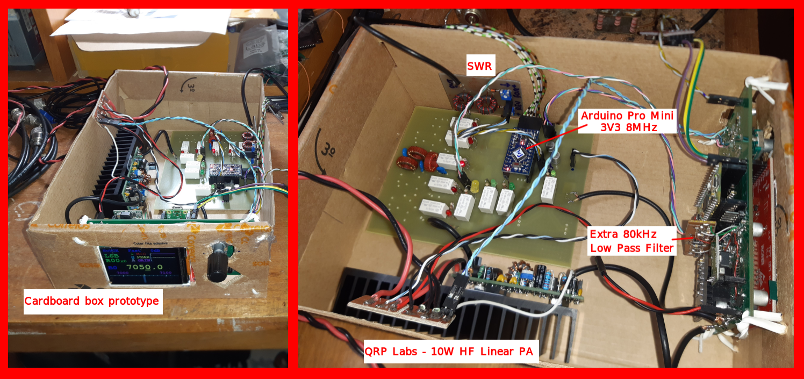
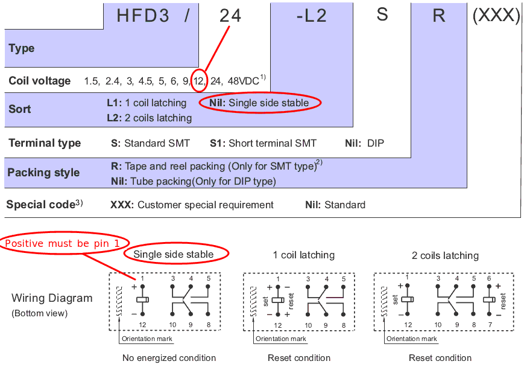
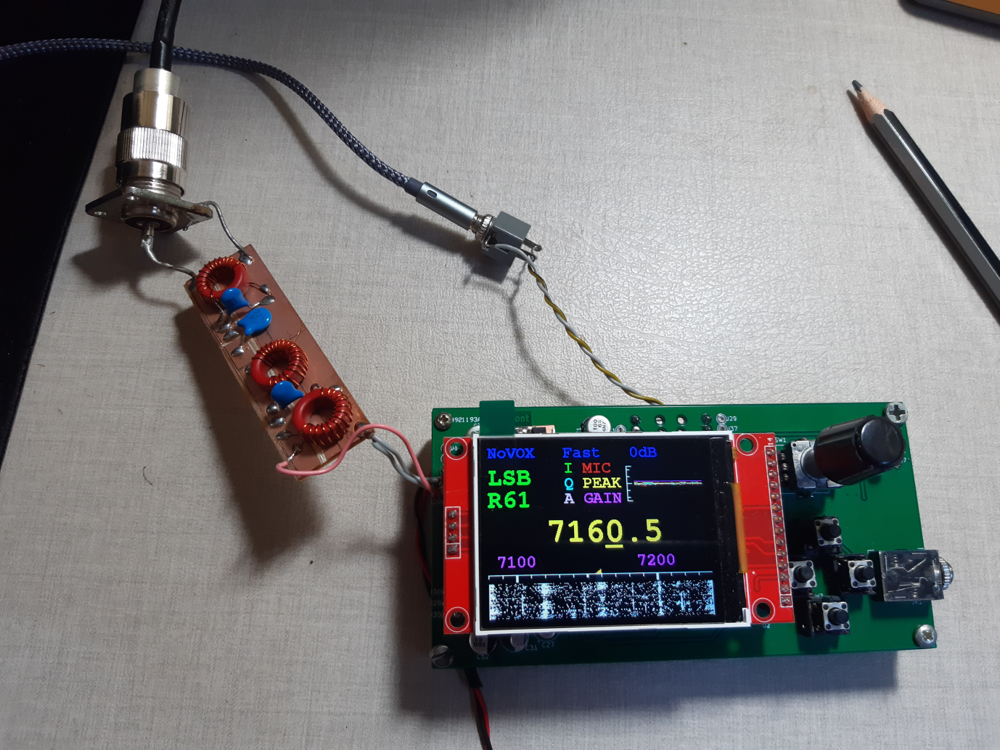
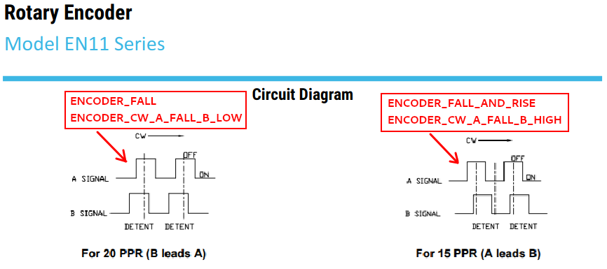

# ARJAN-5
## 5 Band SSB/AM/CW HF Transceiver
## by Klaus Fensterseifer - PY2KLA
### (based on Arjan te Marvelde / uSDR-pico)

This project is a QSD/QSE Software Defined HF Transceiver (SDR), 5 Band, Low Power, based on  Arjan te Marvelde / uSDR-pico, from https://github.com/ArjanteMarvelde/uSDR-pico. I strongly recommend you to take a look there before trying to follow this one.

My intention was to include a waterfall or panadapter to the Arjan's uSDR-pico project, for this, I included an ILI9341 240x320 2.4" TFT display without touch, and also, changed the software to generate the waterfall.

Initially, I have used Visual Studio, but after some considerations, I ported all code to Arduino IDE. So, to compile and run this code you need the Arduino IDE installed for a Raspberry Pi Pico project.

I also, chose not to change the original software as much as possible, and focused on the waterfall implementation, mostly in the dsp.c.

I used the word "uSDX" instead of "uSDR" to name some files. This was a mistake. My intention was to follow Arjan's project with the same names.

Initial tests video:  https://youtu.be/0zGAnkRjizE 
AGC and Visual Scope video: https://youtu.be/BiaS002xZfw 
Transmission test video: https://drive.google.com/file/d/1Rr4CVPphtcBfMTgRN5z8F7xxByQ_1ybG/view 

There are also some messages related to this project at: 
https://groups.io/g/ucx 
Subject: uSDR-pico on GitHUB 
Initial msg: #15923 · May 26  2022 
 

There is a **uSDX_TX** folder with code to test RF modulation using **phase and amplitude**, the same method used at the **uSDX project** (https://github.com/threeme3/usdx). 
 
 

### First Protpype with TX and RX

 
 

### To implement the waterfall I considered this:

- There are 3 ADC inputs: I, Q and MIC  (if we remove the VOX function, we could remove the MIC ADC during reception, this will increase the ADC frequency for I and Q, improving the frequencies we can see at the display - for now I will keep it like the original).
- The max ADC frequency is 500kHz, I have changed it to 480kHz (close to the original) to make the divisions "rounded".
- The ADC for audio reception has frequency of 16kHz (close to the original). I have tested higher frequencies, but the time became critical, without so much benefit.
- The max ADC frequency for each sample = 480kHz / 3 = 160kHz   (because there is only one internal ADC used to read the 3 inputs in sequence).
- With 160kHz of samples, we can see 80kHz range after the FFT, but applying Hilbert to get the lower band and the upper band, we get two bands of 80kHz, above and below the center frequency.
- There is no time to process each sample at 160kHz and generate the "live" audio, so I use this method:
    Set the DMA to receive 10 samples of each ADC input (10 x 3 = 30) and generate an interrupt.
    So, we get 16kHz interrupts with 10 x 3 samples to deal. 
    For audio, we need only one sample at each interruption of 16kHz. At this point, there is a low pass filter to remove any frequency above 8kHz. 
    For FFT, we need all samples (raw samples), so they are copied to a FFT buffer for later use.
- There is also no time to process the samples and run the audio receiver part at 16kHz, so I chose to split it. The interrupt and buffer/filter part is done at Core1, and the audio original reception is in the Core0.
- Every 16kHz interrupt, after filtering the I, Q and MIC, these samples are passed to Core0 to follow the audio reception tasks.
- For the waterfall, when we have received 320 I and Q samples, it stops filling the buffer and indicates to the Core1 main loop to process FFT/Hilbert for a new graphic line.
- The original processes run at Core0, every 100ms.
- There is a digital low pass filter FIR implemented at the code (like the original) that will give the passband we want for audio.
  This filter was calculated with the help of this site:  http://t-filter.engineerjs.com/
  The dificulty is that the number of filter taps can not be high (there is no much time to process it), so the filter must be chosen carefully.
- Please consider that this waterfall is not perfect, I had to let go of some rules to make it.
- Block diagram at "Arduino_uSDR_Pico_FFT.png":

### ADC Aliasing filter considerations:
**Input:** We sample each signal I, Q and MIC at 160kHz, so it is necessary to have a hardware low pass filter for 80kHz on each input (anti-aliasing filter). If the input filter is set to lower than 80kHz, the waterfall will show less than +-80kHz of signals. If the input filter is set to higher then 80kHz, the audio and the waterfall could peek some signals greater than 80kHz and treat them as lower than 80kHz (this is the ADC aliasing problem). 
**Output:** We deliver an audio signal at 16kHz sample frequency, so we need a hardware low pass filter for less than 8kHz at the output. The sample frequency will be present and needs to be removed as it is also an audio frequency.

## Microcontroller RP2040 notes:
- Core0 and Core1 are too much connected and affect each other. This made me lose some painful hours...
- There are only 3 ADC ports available.
- There are some reports at internet about the low quality of the RP2040 ADC readings (https://pico-adc.markomo.me/).

## Arduino IDE setup and notes:
- I am using Arduino IDE version 2.0.1 in Linux/Ubuntu
- Lib used: TFT_eSPI by Bodmer
- **IMPORTANT: Use the comments at beginning of  .ino  file to "adjust" the library files to the project.**
- Boards Manager:  Arduino Mbed OS RP2040 Boards. My version is 4.0.2 (Every time I update it, I will need to "adjust" the library files again).
- Do not include EarlePhilhower library (it is just conflitant with Mbed)
- Board: "RaspberryPiPico"  >  Arduino Mbed OS RP2040 Boards  >  RaspberryPiPico
- The code files have cpp type, but the code itself is in C (cpp type is used to help in some compiler issues).

## Hardware changes and notes:
- Inclusion of ILI9341 on free pins, using SPI1, and removing the LCD display.
- Schematic diagram at "FFT_LCD_pico.png".
- I noticed that changing the signal in one ADC input, changed the other inputs signal through the resistors for setting half Vref. To solve this, I changed the circuit to have a separate resistor divider for each ADC input.

 

- Use input/output filters for ADC Aliasing considerations (see above). 
- Obs.: at the initial test video, I used only the RC output filter shown in the schematic, and for input filter, only what is already inside of the Softrock RXTX Ensemble.

## Keys description 
**Normal operation:** 
Encoder = to change the frequency at the cursor position 
Left key = move the cursor to left 
Right key = move the cursor to right 
Enter key = We can adjust the Waterfall gain with the Encoder while pressing the Enter key. 
Escape key = to enter on menu mode 
**Menu mode:** 
Escape key = to go back to normal operation 
Left key = to move between the menu items 
Right key = to move between the menu items 
Encoder = to change menu item value 
Enter key = to confirm the menu item value 

 
 
 
 

## Last changes and notes: 

### Oct13 2023
- Now, each band has its own setup, including last frequency used. When changing bands, it will remember the last menu options for each band.
- Included new menu option to save the band setup on Data Flash (non volatile memory), including the frequency. The menu Save will save the actual band and frequency to DFlash. The last band saved will be the one selected after power on.
- Changed the transceiver name to ARJAN-5 (I hope everyone agrees... the name uSDR Pico brings to misunderstandings in my opinion).

### Jul19 2023
- Changing uSDR_Pico_BPF_RX_SCH.pdf and PCB due to Relay HFD3 characteristics.

- Changing the components value on schematic to be the same as my assembly.

- Including my Kicad PCBs layout as ZIP file (I can not give much support on this, use at your risk).

### Jul16 2023
- Changing the 16kHz low pass filter from average sum of samples to a strong lp FIR. Due to I could hear strong stations away multiples of 16kHz.
- Including the Band selection on screen in blue (ex. B0 = Band 0).
- Adjusting the position on screen for receive level and manual gain (ex. R30x12).
Obs.: to use manual gain adjust, press Enter button and turn the frequncy knob.

### Jun2 2023
- Testing an 80KHz Low Pass Filter for I and Q inputs because I can hear some frequency distant strong stations.
- New schematics and PCB for LPF and RX at the same board.
- Added software for Arduino Pro Mini to work as two I2C slaves, replacing the PCF8574's.
- There are some mirror signal at the waterfall, I am looking for the reason.
- I really like the quality of the audio received.

### Apr30 2023
- Included an adjust to the gain in the waterfall, it helps to reduce the noise in the waterfall. Press and keep the Enter button, and turn the frequency knob. This adjust also affects the audio AGC.

### Apr29 2023
- Minor changes, improve comments at .ino file. Trying to get the new PCB running and getting back to software improvement.

### Ago17 2022
- Included sketch folder uSDX_TX to test the Phase and Amplitude TX method.

### Ago07 2022
- PTT input corrected. Now it uses the falling or rising to turn off and on the PTT.
- Including options for encoder at hmi.cpp:  ENCODER_TYPE  ENCODER_DIRECTION

### Ago05 2022
- Now the frequency changes at each encoder step (I am using EC11 encoder and it changed the frequency at every second step)
- Plot to the waterfall improved to spend less time
- Included separate audio filters for CW and AM
- Included side tone for CW TX
- Writing to display and programming Si5351 only when necessary (finally)
- PTT debounce reduced to allow CW TX (** it needs a 100nF capacitor from PTT pin to ground **)

 

### Jul20 2022
- Waterfall: Changed to fall instead of going up
- Waterfall: Frequency scale moving with main frequency
- Waterfall: Shadow indicating the reception zone
- AGC attack faster
- It shows the reception signal level implemented from audio output and gain

### Jun24 2022
- Few display corrections: central triangle, mode text overwriting.

### Jun13 2022
- 3V3 noise sensitivity test: 
I followed the tips in this post
https://forums.raspberrypi.com/viewtopic.php?t=330208 
It says that a power supply with less noise to Vref is the best for reducing the ADC noise. 
I used a 3V3 linear regulator instead of the Pico on board DC-DC 3v3. 
I connected it externally, in pins VSYS, GND, 3v3_EN and 3V3. 
Connecting 3v3_EN to Gnd disables the on board DC-DC 3v3. 
I used a TPS79933 + caps from VSYS to 3V3 pin. 
I can connect and disconnect it easily. 
The first impression is that this does not improve the sensibility. 
I have found a limit position from RF generator to Softrock receiver to start showing something at the waterfall.
And both DC-DC and TPS look the same to me.

### Jun10 2022
- AGC uncommented and adapted to work. 
	 The AGC is only used at the output audio, not for waterfall.
- A visual scope was implemented to allow visualization of some internal variables. 
	 The variables plotted are: 
	 - I, Q and MIC = ADC inputs 
	 - A = output audio 
	 - PEAK = average of absolute(A) 
	 This gives an input signal level for AGC (min in the middle of the scope height, max at the top) 
	 - GAIN = AGC result.  
	 If the PEAK is high for some time, it decreases the GAIN. With PEAK low, increases GAIN. 
	 Gain has 32 steps: 
	 1 = min AGC gain (almost in the middle of the scope height)   
	 32 = max AGC gain (limited to 25 at the top of scope) 
	 - Obs.: Scope limits:    -25 < y < 25       0 < x < 100 (each 'x' dot time = 1/16kHz) 
	 - Obs.: Variables are scaled to fit in the scope height.
- The signal level meter at the display does not change because it is fixed at the original code (the level depends on the software as well as the hardware). 

## Wish list:
- Improve the S meter, at least to show the AD input signal level (include SWR measurements on TX)
- The AGC needs to be improved (some bug happens with some high level noise)
- Include zoom in the waterfall (frequency range)
- Include RIT (receiver incremental tuning)
- Reduce the minimum step to change the frequency to 50Hz or less
- Check the trasmission on all modes (it is affected the hardware)
- Tests: reception/transmission SSB...  menus...  switches/debounce...   display appearance

## Copyright notice
**The code and electronic designs as well as the implementations presented in this repository can be copied and modified freely, for non-commercial use.
Use for commercial purposes is allowed as well, as long as a reference to this repository is included in the product.**

