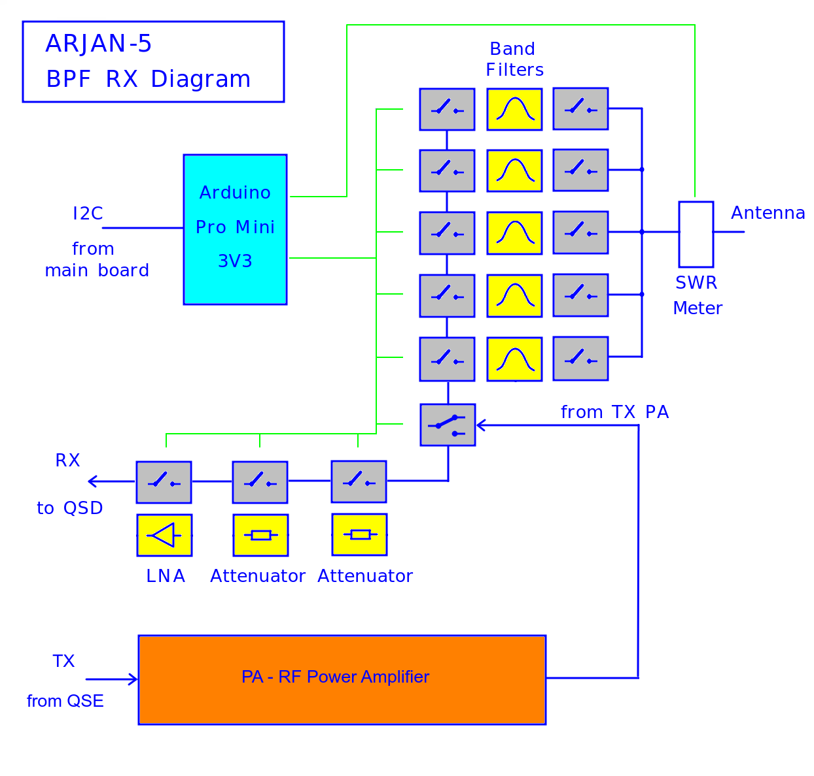

# ARJAN-5
## 5 Band SSB/AM/CW HF Transceiver
## by Klaus Fensterseifer - PY2KLA
### (based on Arjan te Marvelde / uSDR-pico)

This project is a QSD/QSE Software Defined HF Transceiver (SDR), 5 Band, Low Power, based on  Arjan te Marvelde / uSDR-pico, from https://github.com/ArjanteMarvelde/uSDR-pico. 
Since than, Arjan made some changes on his code, so, to clarify, I started this project based on Arjan's version https://github.com/ArjanteMarvelde/uSDR-pico/blob/main/package/CODEv2.zip from 2021 with documentation at https://github.com/ArjanteMarvelde/uSDR-pico/blob/main/doc/uSDR%20-%20v2.02.pdf .

My intention was to include a Waterfall or Panadapter to the Arjan's uSDR-Pico project. For this, I included an ILI9341 240x320 2.4" TFT display, without touch, and also, changed the software to generate the Waterfall.

Initially, I used Visual Studio, like the original project, but after some considerations, I ported all code to Arduino IDE. So, to compile and run this code you need the Arduino IDE installed for a Raspberry Pi Pico project (see "Arduino IDE setup and notes:" below).

I also, chose not to change the original software as much as possible, and focused on the Waterfall implementation, mostly in the dsp.c.

The Arjan-5 and uSDR-Pico **DO NOT USE** the uSDX Amplitude/Phase for transmission like the PE1NNZ uSDX project.

I used the word "uSDX" instead of "uSDR" to name some files. This was a mistake. My intention was to follow Arjan's project with the same names. 

## Basic connections for initial tests

 

Initial tests video:  https://youtu.be/0zGAnkRjizE 
AGC and Visual Scope video: https://youtu.be/BiaS002xZfw 
Transmission test video: https://drive.google.com/file/d/1Rr4CVPphtcBfMTgRN5z8F7xxByQ_1ybG/view 

There are also some messages related to this project at: 
https://groups.io/g/ucx 
Subject: uSDR-pico on GitHUB 
Initial msg: #15923 · May 26  2022 
 

## Repository folders
**Arduino_I2C_BPF_RX** - Code to control the Band Pass Filter (BPF) board. It runs at Arduino Pro Mini, compiled with Arduino IDE. The Arduino Pro Mini is used replacing the uSDR-Pico I2C interfaces PCF8574's to allow extra features: SWR reading and others (future). It uses the same I2C protocol, as uSDR-Pico. 
**Arduino_uSDX_Pico_FFT** - Main code for Ajan-5, runs at Raspberry Pi Pico, compiled with Arduino IDE (look "Arduino IDE setup and notes" below). 
**PCB** - Schematic and PCB Layout on Kicad format. 
**Pictures** - Pictures in general used in this Readme file. 
**uSDX_TX** - Code to test RF modulation TX using Amplitude/Phase, the same method used at the PE1NNZ uSDX project (https://github.com/threeme3/usdx) running at RP2040, only for transmission. 
 
 

## Main Board Block Diagram
- Arjan-5 uses the same modules connections as uSDR-pico.

 

## Band Pass Filters, Attenuators and Low Noise Amplifier Board Block Diagram

 

## Main Board Top and Botton

 

 
Obs.: Don't mind the red wires on the PCB, they are only test for separted 5V power supply.
 

## First Prototype with TX and RX

## Second Prototype (all in a metallic box)

 

## Microcontroller RP2040 notes:
- Core0 and Core1 are too much connected and affect each other. This made me lose some painful hours...
- There are only 3 ADC ports available.
- There are some reports at internet about the low quality of the RP2040 ADC readings (https://pico-adc.markomo.me/).

## Hardware changes from the original SDR-Pico and notes:
- I chose to make a main board with the Pico, Display, QSD/QSE and 5V power supply, and another board with the relays, filters and attenuators.
- The main change from SDR-Pico is the inclusion of ILI9341 on Pico free pins, using SPI1, and removing the LCD display.
- Another change, as we need more frequency range on RX to show at the Waterfall, the RX amplifier must amplify at least 80kHz of signal band. The opamp must be changed to one with wider bandwidth.
- You can see the schematic diagram at [uSDR_Pico_FFT_SCH.pdf](PCB/uSDR_Pico_FFT_SCH.pdf) and [uSDR_Pico_BPF_RX_SCH.pdf](PCB/uSDR_Pico_BPF_RX_SCH.pdf).
- I noticed that changing the signal in one ADC input, changed the other inputs signal through the resistors for setting half Vref. To solve this, I changed the circuit to have a separate resistor divider for each ADC input.

 

- Use input/output filters for ADC Aliasing considerations (see below). 
- Obs.: at the initial test video, I used only the RC output filter shown in the schematic, and for input filter, only what is already inside of the Softrock RXTX Ensemble.
 

## Hardware changes from initial version of my Schematic and PCB:
- Include a reversion VCC connector protection = series diode  

- Include an extra RC to the audio output filter  

- The PTT output signal generated on GPIO15 (pin 20) used to switch the filters and the Power Amplifier needs:  
    A transistor to convert from 3v3 to 12V. 
    Include a 1K resistor between GPIO15 (pin 20) and 3V3 (pin 36). 
    Increase the value of C44 from 1n to 100n. 
    Reduce the value of R25 to 10R.

 

## Software Notes 
### Arduino IDE setup and notes:
- I am using Arduino IDE version 2.0.1 in Linux/Ubuntu
- Lib used: TFT_eSPI by Bodmer
- **IMPORTANT: Use the comments at beginning of  .ino  file to "adjust" the library files to the project.**
- Boards Manager:  Arduino Mbed OS RP2040 Boards. My version is 4.0.2 (Every time I update it, I will need to "adjust" the library files again).
- Do not include EarlePhilhower library (it is just conflitant with Mbed)
- Board: "RaspberryPiPico"  >  Arduino Mbed OS RP2040 Boards  >  RaspberryPiPico
- The code files have cpp type, but the code itself is in C (cpp type is used to help in some compiler issues).

### To implement the Waterfall I considered this:

- There are 3 ADC inputs: I, Q and MIC  (if we remove the VOX function, we could remove the MIC ADC during reception, this will increase the ADC frequency for I and Q, improving the frequencies we can see at the display - for now I will keep it like the original).
- The max ADC frequency is 500kHz, I have changed it to 480kHz (close to the original) to make the divisions "rounded".
- The ADC for audio reception has frequency of 16kHz (close to the original). I have tested higher frequencies, but the time became critical, without so much benefit.
- The max ADC frequency for each sample = 480kHz / 3 = 160kHz   (because there is only one internal ADC used to read the 3 inputs in sequence).
- With 160kHz of samples, we can see 80kHz range after the FFT, but applying Hilbert to get the lower and the upper band, we get two bands of 80kHz, above and below the center frequency.
- There is no time to process each sample at 160kHz and generate the "live" audio, so I use this method:
    Set the DMA to receive 10 samples of each ADC input (10 x 3 = 30) and generate an interrupt.
    So, we get 16kHz interrupts with 10 x 3 samples to deal. 
    For audio, we need only one sample at each interruption of 16kHz. At this point, there is a low pass filter to remove any frequency above 8kHz. 
    For FFT, we need all samples (raw samples), so they are copied to a FFT buffer for later use.
- There is also no time to process the samples and run the audio receiver part at 16kHz, so I chose to split it. The interrupt and buffer/filter part is done at Core1, and the audio original reception is in the Core0.
- Every 16kHz interrupt, after filtering the I, Q and MIC, these samples are passed to Core0 to follow the audio reception tasks.
- For the Waterfall, when we have received 320 I and Q samples, it stops filling the buffer and indicates to the Core1 main loop to process FFT/Hilbert for a new graphic line.
- The original processes run at Core0, every 100ms.
- There is a digital low pass filter FIR implemented at the code (like the original) that will give the passband we want for audio.
  This filter was calculated with the help of this site:  http://t-filter.engineerjs.com/
  The dificulty is that the number of filter taps can not be high (there is no much time to process it), so the filter must be chosen carefully.
- Please consider that this Waterfall is not perfect, I had to let go of some rules to make it.
- Software Block diagram at "Arduino_uSDR_Pico_FFT.png":

### ADC Aliasing filter considerations:
**Input:** We sample each signal I, Q and MIC at 160kHz, so it is necessary to have a hardware low pass filter for 80kHz on each input (anti-aliasing filter). If the input filter is set to lower than 80kHz, the Waterfall will show less than +-80kHz of signals. If the input filter is set to higher then 80kHz, the audio and the Waterfall could peek some signals greater than 80kHz and treat them as lower than 80kHz (this is the ADC aliasing problem). 
**Output:** We deliver an audio signal at 16kHz sample frequency, so we need a hardware low pass filter for less than 8kHz at the output. The sample frequency will be present and needs to be removed as it is also an audio frequency.

 
 

## Operational Notes 
### Keys description 
**Normal operation:** 
Encoder = to change the frequency at the cursor position 
Left key = move the cursor to left 
Right key = move the cursor to right 
Enter key = We can adjust the Waterfall gain with the Encoder while pressing the Enter key. 
Escape key = to enter on menu mode 
**Menu mode:** 
Escape key = to go back to normal operation 
Left key = to move between the menu items 
Right key = to move between the menu items 
Encoder = to change menu item value 
Enter key = to confirm the menu item value 
 
 
 

## Application Menu Description 

The menu uses the first line on display to show the status and the options.  

### Menu TUNE: 
Menu position used operate the radio on normal condition. It shows the actual values for the menus: Mode, VOX, AGC and Pre. 

### Menu Mode: 
Options: "USB","LSB","AM","CW" 
Define the modulation mode used for transmition and reception. 

### Menu AGC: 
Options:  "NoAGC","Slow","Fast" 
Define the Automatic Gain Control mode of actuation. (It needs improvement) 

### Menu Pre: 
Options:  "-30dB","-20dB","-10dB","0dB","+10dB" 
Define the use of the attenuators and pre-amplifier on reception. It uses the relay board to switch between the options. 

### Menu VOX: 
Options:  "NoVOX","VOX-L","VOX-M","VOX-H" 
Defines de use of the VOX feature. (It needs improvement) 

### Menu Band: 
Options:  "<2.5","2-6","5-12","10-24","20-40"  MHz 
Defines the filter used for RX and TX, and consequently the frequency band. It uses the relay board to switch between the options. 

### Menu Memory: 
Options:  "Save" 
It saves the actual band setup on flash memory, so when we come back to this band after power on, it will start with the setup saved. The last band saved will be the selected band used after power on. 

### Menu Audio: 
Options:  "Rec from TX", "Rec from RX", "Play to TX", "Play to Speaker" 
It enables to store 10s max. of audio from the RX or TX (= microphone), and also play it to speaker or to TX. 
It starts to save/play when pressing < Enter >, and will stop after 10s or when pressing < Escape >. 

 
 
 

## Last changes and notes: 

### Oct28 2024
- Including a CW Morse Decoder. It will try to interpret the CW sound and translate it to letters on display. To enable the decoder you just need to select CW on MODE menu and tune to the highest sound level CW reception. It is still in testing (be patient). 

 

### Oct23 2024
- New changes related to RX S-Meter and TX Power/SWR on display. The TX Power/SWR is valid only when using Arduino Pro Mini to control the filter relays. Arduino Pro Mini allows to measure the Forward and Reverse values from SWR board. The Pico has no extra ADC for this. I included the values read from SWR board on display. 

 

- There is a  
 #define I2C_Arduino_Pro_Mini  1    //=1 when I2C BPF and Atten is commanded with Arduino Pro Mini (allow SWR reading) 
on relay.h to define if the Arduino Pro Mini is part of the project. 
- There is a table swr_pow[] on hmi.cpp to make the correlation from the ADC forward power measured and the value showed at display. 
- There is a table Smeter_table_level[] on hmi.cpp to make the correlation from the ADC I and Q audio level measured and the value showed at display. 
- Corrections on Arduino Pro Mini I2C routines. 
- I included here a short description of the menus: "Application Menu Description". 
- Just to remember, there is a "Discussions" folder on the Github Project site (look above) to allow comments about the project, as the ucx groups.io forum could not be the right place for it. 
(https://github.com/kaefe64/Arduino_uSDX_Pico_FFT_Proj/discussions) 

### Ago20 2024
- It will move the Waterfall in block (all lines) when changing the frequency (instead of moving only the last line received). 

### Ago03 2024
- S Meter corrections. 

### Jul29 2024
- S Meter implementation. 
  Starting tests with a S Meter and Bar Graph. 
  There is a table (Smeter_table_level[]) to make the correspondence between the audio level and the S meter level. 
  The values on the code are **not calibrated**. To get the audio level on the display, to make your own calibration, uncomment this line :   //#define   SMETER_TEST   10    on "hmi.h". 

### Jan05 2024
- Correcting internal PTT activation from Monitor and Vox. 
  There are some necessary hardware changes to be made: 
    Include a 1K resistor between GPIO15 (pin 20) and 3V3 (pin 36). 
    Increase the value of C44 from 1n to 100n. 
    Reduce the value of R25 to 10R.
- New functions on menu **to record and play the audio** from reception(RX) or transmission(TX) (max. 10s)

### Nov12 2023
- Correcting Arjan's name.
- Switching the PTT pin when TX in VOX mode.

### Oct13 2023
- Now, each band has its own setup, including last frequency used. When changing bands, it will remember the last menu options for each band.
- Included new menu option to save the band setup on Data Flash (non volatile memory), including the frequency. The menu Save will save the actual band and frequency to DFlash. The last band saved will be the one selected after power on.
- Changed the transceiver name to ARJAN-5 (I hope everyone agrees... the name uSDR Pico brings to misunderstandings in my opinion).

### Jul19 2023
- Changing uSDR_Pico_BPF_RX_SCH.pdf and PCB due to Relay HFD3 characteristics.

- Changing the components value on schematic to be the same as my assembly.

- Including my Kicad PCBs layout as ZIP file (I can not give much support on this, use at your risk).

### Jul16 2023
- Changing the 16kHz low pass filter from average sum of samples to a strong lp FIR. Due to I could hear strong stations away multiples of 16kHz.
- Including the Band selection on screen in blue (ex. B0 = Band 0).
- Adjusting the position on screen for receive level and manual gain (ex. R30x12).
Obs.: to use manual gain adjust, press Enter button and turn the frequncy knob.

### Jun2 2023
- Testing an 80KHz Low Pass Filter for I and Q inputs because I can hear some frequency distant strong stations.
- New schematics and PCB for LPF and RX at the same board.
- Added software for Arduino Pro Mini to work as two I2C slaves, replacing the PCF8574's.
- There are some mirror signal at the Waterfall, I am looking for the reason.
- I really like the quality of the audio received.

### Apr30 2023
- Included an adjust to the gain in the Waterfall, it helps to reduce the noise in the Waterfall. Press and keep the Enter button, and turn the frequency knob. This adjust also affects the audio AGC.

### Apr29 2023
- Minor changes, improve comments at .ino file. Trying to get the new PCB running and getting back to software improvement.

### Ago17 2022
- Included sketch folder uSDX_TX to test the Phase and Amplitude TX method.

### Ago07 2022
- PTT input corrected. Now it uses the falling or rising to turn off and on the PTT.
- Including options for encoder at hmi.cpp:  ENCODER_TYPE  ENCODER_DIRECTION

### Ago05 2022
- Now the frequency changes at each encoder step (I am using EC11 encoder and it changed the frequency at every second step)
- Plot to the Waterfall improved to spend less time
- Included separate audio filters for CW and AM
- Included side tone for CW TX
- Writing to display and programming Si5351 only when necessary (finally)
- PTT debounce reduced to allow CW TX (** it needs a 100nF capacitor from PTT pin to ground **)

 

### Jul20 2022
- Waterfall: Changed to fall instead of going up
- Waterfall: Frequency scale moving with main frequency
- Waterfall: Shadow indicating the reception zone
- AGC attack faster
- It shows the reception signal level implemented from audio output and gain

### Jun24 2022
- Few display corrections: central triangle, mode text overwriting.

### Jun13 2022
- 3V3 noise sensitivity test: 
I followed the tips in this post
https://forums.raspberrypi.com/viewtopic.php?t=330208 
It says that a power supply with less noise to Vref is the best for reducing the ADC noise. 
I used a 3V3 linear regulator instead of the Pico on board DC-DC 3v3. 
I connected it externally, in pins VSYS, GND, 3v3_EN and 3V3. 
Connecting 3v3_EN to Gnd disables the on board DC-DC 3v3. 
I used a TPS79933 + caps from VSYS to 3V3 pin. 
I can connect and disconnect it easily. 
The first impression is that this does not improve the sensibility. 
I have found a limit position from RF generator to Softrock receiver to start showing something at the Waterfall.
And both DC-DC and TPS look the same to me.

### Jun10 2022
- AGC uncommented and adapted to work. 
	 The AGC is only used at the output audio, not for Waterfall.
- A visual scope was implemented to allow visualization of some internal variables. 
	 The variables plotted are: 
	 - I, Q and MIC = ADC inputs 
	 - A = output audio 
	 - PEAK = average of absolute(A) 
	 This gives an input signal level for AGC (min in the middle of the scope height, max at the top) 
	 - GAIN = AGC result.  
	 If the PEAK is high for some time, it decreases the GAIN. With PEAK low, increases GAIN. 
	 Gain has 32 steps: 
	 1 = min AGC gain (almost in the middle of the scope height)   
	 32 = max AGC gain (limited to 25 at the top of scope) 
	 - Obs.: Scope limits:    -25 < y < 25       0 < x < 100 (each 'x' dot time = 1/16kHz) 
	 - Obs.: Variables are scaled to fit in the scope height.
- The signal level meter at the display does not change because it is fixed at the original code (the level depends on the software as well as the hardware). 

## Wish list:
- Include RIT (receiver incremental tuning)
- Reduce the minimum step to change the frequency to 50Hz or less
- Tests: reception/transmission modes, bands, menus, ...

## Copyright notice
**The code and electronic designs as well as the implementations presented in this repository can be copied and modified freely, for non-commercial use.
Use for commercial purposes is allowed as well, as long as a reference to this repository is included in the product.**

